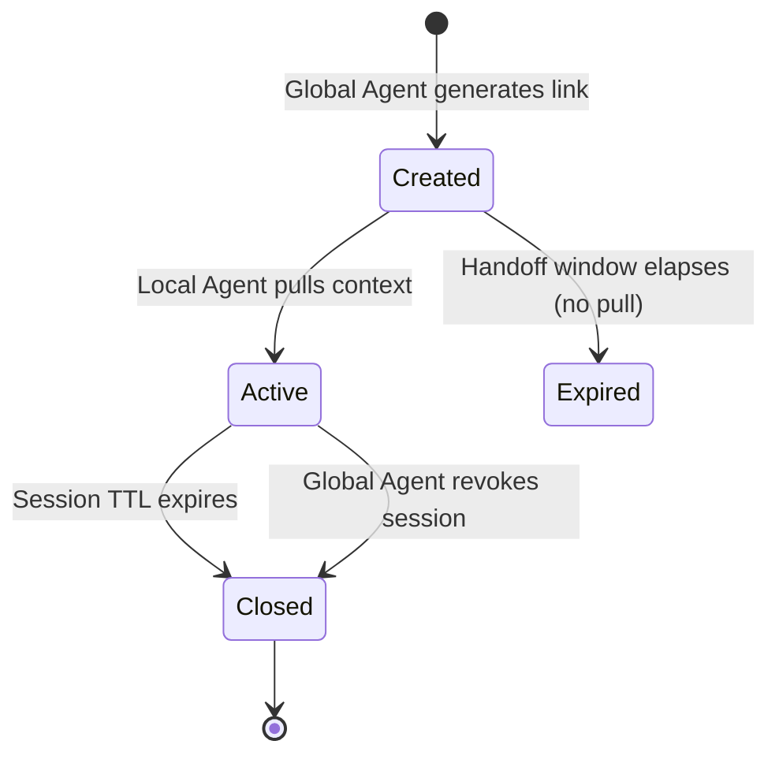

# Design Log #3: Consent Token & Session Lifecycle

## Background

The proposal (§6.1) introduces a `consent_token` described as "a cryptographic proof that the user authorized this specific data transfer." The context response (§4) includes it as a field. However, its structure, contents, and verification flow are undefined.

Separately, the proposal uses "ephemeral" and "short TTL" to describe session lifetime (§4.1, §6.2) but never defines concrete bounds, phases, or what happens when a session ends.

Both gaps affect implementability -- an agent developer reading the spec today cannot build a compliant `consent_token` or know when to expire a session.

## Problem

**Consent token:**
- Who verifies it? The Local Agent? A regulator? The user?
- What claims does it contain?
- Is it round-tripped or one-directional?

**Session lifecycle:**
- How long does the context pull endpoint stay live after the link is generated?
- How long can the Local Agent send feedback?
- What happens when a session expires mid-browsing?
- Can the Global Agent or user explicitly terminate a session?

## Questions and Answers

**Q1: Should the `consent_token` be verifiable by the Local Agent?**
A: Yes. The Local Agent needs proof that the user consented to share the specific data categories it received. This protects the Local Agent from liability ("we received allergy data, but did the user agree to share it?"). The Local Agent can verify using the same `.well-known/act-pubkey.json` keys used for context verification (§6.3).

**Q2: Should the `consent_token` enumerate what was consented to?**
A: Yes, at the category level (not field level). The token should list data categories (e.g., `dietary`, `budget`, `accessibility`) so the Local Agent knows which parts of the payload are consent-backed. This avoids the token becoming a mirror of the payload itself.

**Q3: Should the Local Agent store the `consent_token`?**
A: Yes, as a compliance receipt. The Local Agent MAY store it to demonstrate it received data with valid consent. The token is self-contained (signed JWT), so it can be verified later without contacting the Global Agent.

**Q4: Is the `consent_token` round-tripped back to the Global Agent?**
A: No. It flows one direction: Global Agent → Local Agent. It's proof that travels with the data.

**Q5: Should sessions have a single TTL or multiple phases?**
A: Two phases. The context pull must happen quickly (the user just clicked a link), but feedback may arrive much later (the user might browse for 30 minutes before converting). A single TTL would either be too short for feedback or too long for the handoff window.

**Q6: Can the user or Global Agent terminate a session early?**
A: Yes. The Global Agent should be able to revoke a session (e.g., user closes the conversation). The Local Agent should handle this gracefully -- feedback POSTs to an expired session get `410 Gone`.

**Q7: What happens if the Local Agent never pulls the context?**
A: The session expires after the handoff window. No data is ever shared. The Global Agent can treat this as an unused handoff.

## Design

### Consent Token

The `consent_token` is a **JWS-signed JWT** issued by the Global Agent.

**Claims:**

| Claim | Type | Description |
|---|---|---|
| `iss` | String | Global Agent origin (matches `act_origin`) |
| `sub` | String | The `act_session_id` this token is bound to |
| `iat` | Number | Issued-at timestamp (Unix epoch) |
| `categories` | String[] | Data categories the user consented to share (e.g., `["dietary", "budget", "accessibility"]`) |
| `consent_type` | String | `implicit` (user clicked the link) or `explicit` (user was prompted) |

**Example decoded payload:**

```json
{
  "iss": "agent.google.com",
  "sub": "sess_98765abc",
  "iat": 1750000000,
  "categories": ["dietary", "budget"],
  "consent_type": "explicit"
}
```

**Verification:** Local Agent validates the JWS signature using the Global Agent's public key from `https://[act_origin]/.well-known/act-pubkey.json`. No network call to the Global Agent is needed beyond the initial key fetch (keys can be cached).

**Storage:** The Local Agent MAY store the signed token as a compliance receipt. The token is self-contained and can be verified offline.

### Session Lifecycle



**Phases:**

| Phase | Duration | What's allowed |
|---|---|---|
| **Created** | Link generated → context pulled (or handoff window expires) | Only context GET is accepted |
| **Active** | Context pulled → session TTL or explicit close | Feedback POSTs accepted |
| **Closed** | Terminal state | All requests return `410 Gone` |

**Recommended TTLs:**

| Parameter | Recommended | Rationale |
|---|---|---|
| Handoff window | 5 minutes | User should land on the site shortly after clicking |
| Session TTL | 60 minutes | Covers browsing, comparison, and conversion |
| Feedback token validity | Same as session TTL | Token and session expire together |

Global Agents MAY adjust these within reason. The proposal should define RECOMMENDED values, not hard requirements, since use cases vary (a quick food order vs. a hotel booking session).

**Termination:**
- **Timeout**: Session auto-expires after session TTL.
- **Explicit revocation**: Global Agent can close a session (e.g., user ends the conversation). The Global Agent marks the session as closed; subsequent feedback POSTs receive `410 Gone`.
- **Local Agent behavior on 410**: The Local Agent SHOULD stop sending feedback. The user's browsing experience is unaffected -- only the agent-to-agent link is severed.

**Response codes:**

| Scenario | HTTP Status | Body |
|---|---|---|
| Valid context pull | `200 OK` | Context response |
| Session not yet created / invalid ID | `404 Not Found` | -- |
| Handoff window expired (never pulled) | `410 Gone` | -- |
| Session closed / expired | `410 Gone` | `{"reason": "session_expired"}` |
| Invalid feedback token | `401 Unauthorized` | -- |

## Trade-offs

**Consent token as JWT vs. opaque string:**
- ✅ JWT: Local Agent can verify and store without calling the Global Agent; self-contained; industry standard
- ❌ JWT: Larger payload; Local Agent must fetch and cache public keys
- Decision: JWT. The verification benefit outweighs the size cost, and key caching is standard practice.

**Two-phase session vs. single TTL:**
- ✅ Two-phase: Tight handoff window prevents stale links; longer feedback window supports real browsing sessions
- ❌ Two-phase: More complex for implementers
- Decision: Two-phase. The complexity is minimal (two timers) and the UX benefit is significant.

**Fixed TTLs vs. recommended TTLs:**
- ✅ Fixed: Simpler, predictable
- ❌ Fixed: Use cases vary widely (food order: 10 min; hotel booking: 2 hours)
- Decision: Recommended values with SHOULD-level guidance. Global Agents can tune for their use cases.

## Implementation Plan

1. Add consent token structure to §6.1 (claims, verification, storage)
2. Add new §4.2 "Session Lifecycle" (phases, TTLs, termination, response codes)
3. Update §4 context response example to show a realistic JWT consent token
4. Update §2 terminology to refine "ACT Session" with lifecycle phases
