# Agent Context Transfer (ACT) Protocol v0.3

## 1 Introduction

The **Agent Context Transfer (ACT)** protocol defines a standardized mechanism for a **Global Agent** (e.g., a general-purpose AI assistant) to securely hand off a user’s conversation state, intent, and constraints to a **Local Agent** (e.g., a website-specific AI or service).

The goal of ACT is to eliminate the "cold start" problem when a user clicks a link from an AI assistant to a website, ensuring the website understands exactly what the user is looking for without requiring the user to repeat themselves. In contrast to automation-heavy protocols, ACT is specifically designed to **enhance the human-led browsing experience** by ensuring the website "knows" the nuances of the conversation the user was just having with their Global Agent, allowing for a seamless transition from dialogue to digital storefront or service.

## 2 Terminology

* **Global Agent:** The initiating AI platform (e.g., Gemini, ChatGPT, Claude).  
* **Local Agent:** The destination AI or automated service residing on a specific web domain.  
* **ACT Session:** A temporary, conversation-scoped link between the two agents.  
* **Context Pull:** The process by which a Local Agent fetches structured data from the Global Agent.

## 3 The Handoff (URL Parameters)

When a Global Agent directs a user to a website, it appends a minimal set of parameters to the destination URL. This provides the Local Agent with the "keys" needed to retrieve the full context.

### **Parameters**

| Parameter | Description | Example |
| :---- | :---- | :---- |
| act\_session\_id | A unique, ephemeral identifier for the conversation. | sess\_98765abc |
| act\_origin | The identifier/domain of the Global Agent. | agent.google.com |
| act\_callback\_url | The endpoint where the Local Agent fetches context. | https://api.global-ai.com/v1/act |

**Example URL:**

```
https://italy-eats.com/order?act_session_id=sess_98765abc&act_origin=agent.google.com&act_callback_url=https://api.global-ai.com/v1/act
```

**Implementation Note:** To protect user privacy, browsers and servers SHOULD NOT log act\_ prefixed parameters in plain-text server access logs.

## 4 Context Retrieval (The "Pull" Model)

Upon page load, the Local Agent initiates a server-to-server GET request to the `act_callback_url` using the `act_session_id`.

### 4.1 The Secure Handshake

Upon receiving a user via an ACT-enabled link, the Local Agent's server initiates a **HTTP GET** request to the `act_callback_url`.

* **Discovery**: The Local Agent extracts the `act_session_id` and `act_callback_url` from the URL parameters.  
* **Authentication**: The Local Agent identifies itself in the request header (e.g., via User-Agent or a domain-specific identifier).  
* **Authorization**: The Global Agent validates that the `act_session_id` is active, has not expired (short TTL), and was originally intended for the requesting `act_origin`.

**Example Context Response:**

```json
{ 
 "intent": "quick italian meal", 
  "preferences": { 
    "style": "authentic", 
    "delivery": "express" 
  }, 
  "constraints": { 
    "dietary": ["no_fish", "nut_free"], 
    "max_price": 50.00 
  }, 
  "payload": { 
    "@context": "https://schema.org", 
    "@type": "FoodOrder", 
    "description": "Authentic Italian meal with express delivery",     
    "priceCurrency": "USD", 
    "maximumPayloadPrice": 50.00, 
    "orderLocation": { 
      "@type": "OrderAction", 
      "deliveryMethod": "http://schema.org/OnSitePickup" 
    }, 
    "orderedItem": { 
      "@type": "MenuItem", 
      "suitableForDiet": [ "https://schema.org/NoFishDiet", "https://schema.org/NutFreeDiet" ], 
      "cuisine": "Italian" 
      } 
    },
  "consent_token": "ct_v1_signed_9921", 
}
```

| Field | Type | Description |
| :---- | :---- | :---- |
| intent | String | A concise summary of what the user is trying to achieve. |
| preferences | Object | Key-value pairs of user desires (e.g., style, brand, urgency). |
| constraints | Object | Hard requirements that must be met (e.g., allergies, size, budget). |
| payload | Object | **Schema.org** compatible object, representing the constraints and preferences. |
| consent\_token | String | A cryptographic proof that the user authorized this specific data transfer. |

## 5 The Feedback Loop

The feedback loop allows the Local Agent to notify the Global Agent of significant milestones reached during the session. This data is used to verify "Intent Fulfillment" and to inform the Global Agent's future routing decisions (reputation/quality scoring).

### 5.1 Endpoint Discovery

The Local Agent MUST use the `act_callback_url` provided in the initial handoff. The feedback request is an **HTTP POST** to this URL.

### 5.2 Request Body (Schema)

```json
{ 
  "act_session_id": "sess_98765abc", 
  "description": "User found the item, but requested size (11W) is currently out of stock.", 
  "action": "engagement", 
  "intent_match": "failure", 
  "payload": { 
    "@context": "https://schema.org", 
    "@type": "ItemAvailability", 
    "availability": "https://schema.org/OutOfStock" 
  } 
}
```

| Field | Type | Description |
| :---- | :---- | :---- |
| act\_session\_id | String | The unique ID provided in the initial handoff. |
| description | String | Natural language summary for the Global Agent to explain the status to the user. |
| action | Enum | engagement (user interacting) or conversion (user completed intent). |
| intent\_match | Boolean | **True** if the Global Agent's context was accurate to the site's capability. **False** if the site couldn't fulfill the specific constraints (e.g., "We don't sell size 15"). |
| payload | Object | **Schema.org** compatible object, giving more details about the engagement / conversion |

## 6 Privacy & Consent

### 6.1 The Consent Orchestrator

The Global Agent serves as the primary **Consent Orchestrator** for the user journey. Unlike traditional web tracking where consent is often managed by invisible scripts, ACT makes consent explicit and centralized:

* **Role**: The Global Agent is responsible for auditing the user's conversation and identifying sensitive data (e.g., health, finance, or PII).  
* **Execution**: Before releasing an Intent Package via the callback URL, the Global Agent must ensure appropriate consent.  
  * **Implicit Intent:** General parameters (e.g., "blue sneakers") are consented to by the user's action of clicking the link.  
  * **Explicit Sensitive Data:** For constraints such as medical allergies or precise location, the Global Agent must trigger a UI prompt: *"Share your allergy profile with \[Local Agent\]?"*  
* **The Token as Certification**: When a Local Agent receives a context response, the existence of that data serves as a cryptographic certification that the Consent Orchestrator has verified the user's permission to share that specific information for that specific session.

### 6.2 The "Cookie-Free" Evolution

ACT replaces the "guessing" model of traditional web tracking with explicit, conversation-driven communication:

* **Intent over ID**: The Local Agent focuses strictly on the "what" (user intent) rather than the "who" (Personal Identifiable Information).  
* **Zero-Knowledge Start**: Because personalization is driven by a server-to-server pull, no tracking cookies are required to "remember" a user's search criteria. This eliminates the need for third-party tracking pixels to maintain state.  
* **Session De-identification**: The `act_session_id` is ephemeral. Once the conversation ends, the link between the Global Agent's user identity and the Local Agent's visitor is severed, preventing long-term profile building.

### 6.3 Security & Verification

To prevent malicious actors from spoofing user intent or preferences, Local Agents MUST verify the source of the context.

* **Trust Root**: Global Agents shall publish their public keys at a standardized location: `https://[origin]/.well-known/act-pubkey.json`.  
* **Verification**: The Context Payload response SHOULD be signed (e.g., using JWS), allowing the Local Agent to confirm that the intent data is authentic and originates from the stated Global Agent. This ensures that constraints (like food allergies) cannot be tampered with by a man-in-the-middle.

## 7 Design Alternatives & Decisions

During the development of this spec, the following alternatives were explored and rejected:

* **Raw Data in URL (Rejected):** Initially considered passing Base64 encoded context in the URL. This was rejected due to URL length limits (2KB in many browsers), lack of security (data exposure in logs), and the inability to update context dynamically.  
* **Mutual Secret Pre-sharing (Rejected):** Requiring every website to have a pre-shared API key with every Global Agent is not scalable. We moved to a **Public Key Infrastructure (PKI)** model to allow any Local Agent to verify any Global Agent.  
* **Client-side POST Handoff (Rejected):** Using a form POST to redirect the user is disruptive to the user experience and often blocked by modern browser security settings. The "Pull" model is more robust and allows for asynchronous data retrieval.

### Comparison with Existing Methods

The ACT protocol occupies a unique space between general web browsing and deep application integration.

| Feature | ACT Protocol | WebMCP (Model Context Protocol) | A2A (Agent-to-Agent) |
| :---- | :---- | :---- | :---- |
| **User Experience** | **Visible & Interactive.** The user clicks a link and browses the site. | **Headless/Background.** The agent performs actions on the user's behalf. | **Delegated.** One agent gives a task to another; the user may not be present. |
| **Control** | The user remains in control of the browser. | Global Agent controls the browser/DOM. | Local Agent controls the task execution. |
| **Data Flow** | **Context Transfer.** The site is "pre-filled" with intent. | **Direct Manipulation.** The agent clicks buttons and scrapes data. | **API Orchestration.** Structured data exchange between services. |
| **Privacy** | **Consent-Based.** The user chooses to click and share. | **Permission-Based.** The user gives Agent access to "act as me." | **Contract-Based.** Secure handshake between two systems. |
| **Adoption Barrier** | **Low.** Works with existing HTTP infrastructure. | **Medium.** Requires specific webMCP enabled browsers. | **High.** Requires complex multi-agent orchestration. |

**Key Differentiator:** 

**WebMCP** (and similar Model Context Protocols) essentially treats the website as a "headless tool" for the agent to manipulate directly via automation (RPAs or browser-control layers).

In contrast, **ACT** is about **enhancing the human-led browsing experience** by ensuring the website "knows" what the human and the Global Agent were just discussing.

## 8 Examples

### Hotel Search

This end-to-end example follows a **User** looking for a specific **Hotel Stay** through a **Global Agent**, transitioning to a **Local Agent** (https://www.google.com/search?q=BoutiqueHotels.com).

```mermaid
%%{init: {
  &#39;theme&#39;: &#39;base&#39;,
  &#39;themeVariables&#39;: {
    &#39;primaryColor&#39;: &#39;#f6f8fa&#39;,
    &#39;primaryTextColor&#39;: &#39;#24292f&#39;,
    &#39;primaryBorderColor&#39;: &#39;#d0d7de&#39;,
    &#39;lineColor&#39;: &#39;#8c959f&#39;,
    &#39;secondaryColor&#39;: &#39;#ffffff&#39;,
    &#39;tertiaryColor&#39;: &#39;#f6f8fa&#39;
  }
}}%%
sequenceDiagram
    participant User
    participant GlobalAgent as Global Agent (AI)
    participant Browser as Hotel Deluxe site
    participant LocalAgent as Local Agent (Hotel Server)

    User->>GlobalAgent: "Find a boutique hotel in Paris for June 12-15. <br>I need a suite with an Eiffel Tower view, <br>wheelchair accessible, under $600/night."
    GlobalAgent->>User: "I found the perfect Suite at Hotel-De-Luxe. <br>[View Details & Book]"
    
    User->>Browser: Click Link
    Note over Browser: URL: hotel-deluxe.com/book?act_session_id=paris-442&<br>act_callback_url=https://api.agent.ai/act
    
    Browser->>LocalAgent: GET /book (Initial Request)
    
    rect rgb(240, 248, 255)
    Note right of LocalAgent: [Step 1] Context Retrieval (Pull)
    LocalAgent->>GlobalAgent: GET https://api.agent.ai/act?session_id=paris-442
    GlobalAgent-->>LocalAgent: Return JSON (Intent + Schema.org + Constraints)
    end

    LocalAgent->>Browser: Render page pre-filled with Suite, <br>Dates, and Accessibility filters.
    User->>Browser: Clicks "Confirm Reservation"

    rect rgb(245, 245, 245)
    Note right of LocalAgent: [Step 2] Feedback Loop (Push)
    LocalAgent->>GlobalAgent: POST https://api.agent.ai/act (Order Success)
    end
    
    LocalAgent->>Browser: Show Confirmation Page
```



#### 1 User search in Global Agent

Our user is searching for a boutique hotel in Paris for June 12-15. They are looking for a suite with an Eiffel Tower view, wheelchair accessible, under $600/night.

The global agent finds one or more options, and the user clicks on one of the options, a link to the Hotel Deluxe site to book a room. The link is an ACT link \- regular link with the act params.

#### 2 Payload: Context Retrieval (The Pull)

The Hotel Deluxe (Local Agent server) receives the `act_session_id` and calls the Global Agent to understand the user needs and constraints \- and learns about the "Eiffel Tower view" preference and the "Accessibility" needs.

The Hotel Deluxe site then shows the user the right room options that meet the user preferences and constraints.

**Response from Global Agent:**

JSON

```
{
  "act_session_id": "paris-442",
  "intent": "book_boutique_hotel_paris",
  "payload": {
    "@context": "https://schema.org",
    "@type": "LodgingReservation",
    "checkinDate": "2026-06-12",
    "checkoutDate": "2026-06-15",
    "numAdults": 2,
    "lodgingUnitType": {
      "@type": "QualitativeValue",
      "name": "Suite",
      "additionalProperty": {
        "@type": "PropertyValue",
        "name": "View",
        "value": "Eiffel Tower"
      }
    }
  },
  "constraints": {
    "accessibility": ["wheelchair_accessible"],
    "max_price_per_night": 600,
    "currency": "USD"
  },
  "preferences": {
    "vibe": "boutique",
    "location_priority": "central"
  },
  "consent_token": "sig_9901_verified"
}
```

---

#### 3 Payload: Feedback Loop (The Push)

The user successfully completes the booking. The Local Agent notifies the Global Agent so it can "congratulate" the user and update its own memory of the trip.

**Request to Global Agent:**

JSON

```
{
  "act_session_id": "paris-442",
  "action": "conversion",
  "intent_match": true,
  "description": "User successfully booked the Eiffel Tower Suite for June 12-15.",
  "payload": {
    "@context": "https://schema.org",
    "@type": "LodgingReservation",
    "reservationNumber": "FR-77821",
    "reservationStatus": "https://schema.org/Confirmed",
    "totalPrice": "1750.00",
    "priceCurrency": "USD",
    "underName": {
      "@type": "Person",
      "name": "User Name"
    }
  }
}
```

---

#### 4 Why this works for both Agents

* **The Local Agent** didn't have to ask the user "What dates?" or "Do you need a suite?" It received the `LodgingReservation` schema and instantly filtered its database to show only the matching rooms.  
* **The Global Agent** received a structured `reservationNumber` back. If the user later says to the AI, *"When is my Paris check-in?"*, the Global Agent already has the answer in its logs because of the Feedback Loop.

